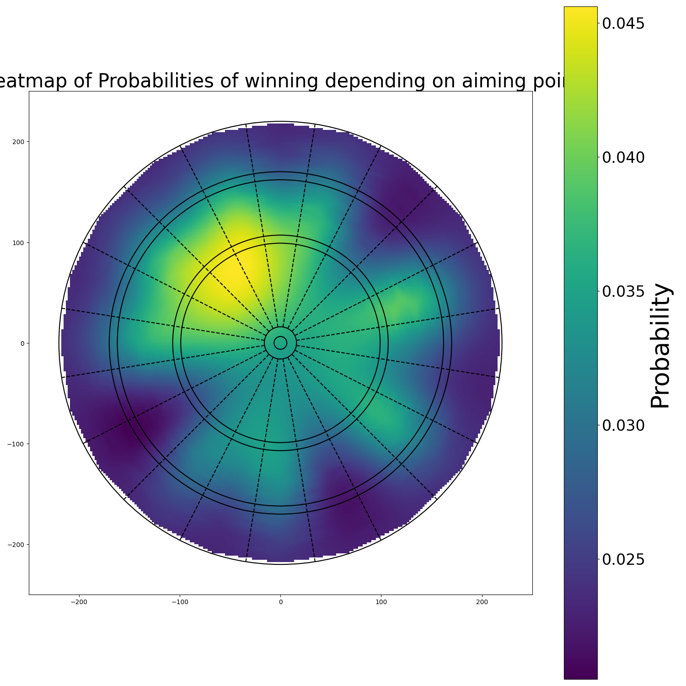
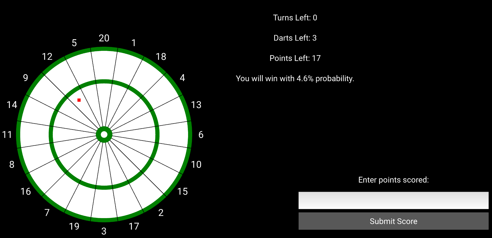

In optimisation problems, it is rarely realistic to assume that everything is deterministic.  
This repository presents a simple example of how uncertainty can be handled in optimisation: **a darts game**.

# Darts Strategy Optimiser

Playing darts with your friends and want to maximise your chances of winning? This repo is for you ([see Disclaimer](#disclaimer)).

### Game rules

"Double out" rules are applied: one must finish hitting a double or double bullseye.

E.g. with 16 points left, hitting 16 doesn't win, you must hit double 8 instead (exterior ring).

### Finding your skill

Depending on how often you can hit the bullseye (together with double bullseye), you can choose a skill level:
- **Top-10 professional** → **~70%** of the time → skill in the game: 10 
- **Professional player** → **~42%** of the time → skill in the game: 15 
- **Amateur league player** → **~25%** of the time → skill in the game: 20 
- **Amateur / casual player** → **~10%** of the time → skill in the game: 35

### How to run

Given your score, number of turns you want to finish in, and your skill, the program computes the best aiming position.  
<p align="center">
  <a href="#setup-and-run">
    
  </a>
</p>

### Heatmap
Indicating, for example, 17 points left, 1 turn and skill 35, a heatmap showing the probability of winning when aiming at each point on the dartboard is displayed,
<p align="center">
  
</p>


### Interactive application
After closing the heatmap, an interactive application will pop up to guide you through your throws.



## Setup and Run

From the project root, create a virtual environment, install the dependencies, and run `main.py`.

### macOS / Linux

```bash
python3 -m venv .venv
source .venv/bin/activate
python -m pip install --upgrade pip
pip install -r requirements.txt
python main.py
```

### Windows (Command promt)

```bash
python -m venv .venv
.venv\Scripts\activate.bat
python -m pip install --upgrade pip
pip install -r requirements.txt
python main.py
```


#### Disclaimer

This repository is used only to illustrate the technology used to optimise under uncertanty. If you want a program for a more realistic scenario (i.e. having an oponent), please contact the owner of the repository.